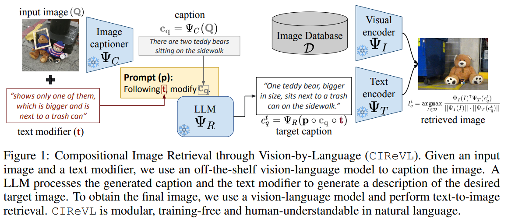



**TL;DR**: A training-free, modular, and interpretable approach that leverages LLMs to enhance text-based queries for compositional image retrieval.

> **Note:** This is my personal learning note, so **some points may not be entirely accurate**. I strive to improve my understanding and will correct any errors I find. If you spot any inaccuracies, please feel free to share your insights to help enhance the content 😊.

## Summary

The paper introduces **CIReVL** (Compositional Image Retrieval through Vision-by-Language), a novel zero-shot compositional image retrieval (ZS-CIR) method. CIReVL leverages existing pre-trained vision-language models (VLMs) and large language models (LLMs) to **perform CIR without any additional training**.

## Motivation

Traditional CIR approaches rely on **supervised training** with annotated triplets (query image, modifying text, target image), which are **expensive and time-consuming** to obtain. Existing ZS-CIR methods often still require training task-specific modules on large image-caption datasets. **CIReVL** addresses these limitations by using **only pre-trained models** in a **modular, interpretable** fashion, offering a more accessible alternative.

## Methodology

CIReVL operates through three main steps:

1. **Captioning:** A pre-trained VLM (e.g., BLIP-2) generates a detailed caption for the query image.
2. **Reasoning:** An LLM (e.g., GPT-3.5-turbo) processes the generated caption and modification instruction to produce a target caption that reflects the intended changes.
3. **Retrieval:** A second VLM (e.g., CLIP) encodes the target caption and the database images to retrieve the image most similar to the target description.

## Why CIReVL Stands Out

- **Training-Free:** CIReVL doesn’t require any additional training, relying entirely on off-the-shelf pre-trained models, which enhances efficiency and scalability.
- **Modular Design:** This modular approach allows easy replacement or scaling of individual components, enabling exploration of different VLMs and LLMs.
- **Human-Interpretable:** Most of the compositional processing occurs in the language domain, making it interpretable and allowing for human intervention in case of potential errors.
- **State-of-the-Art Performance:** CIReVL matches or surpasses existing training-based and zero-shot methods on several CIR benchmarks, including CIRCO, CIRR, FashionIQ, and GeneCIS.

## Conclusion

CIReVL presents a promising new direction for zero-shot CIR research. Its training-free, modular, and interpretable design, along with its high performance, makes it a compelling approach for future work in ZS-CIR.

## Reference
- [Vision-by-Language for Training-Free Compositional Image Retrieval | ICLR 2024](https://arxiv.org/abs/2310.09291)

