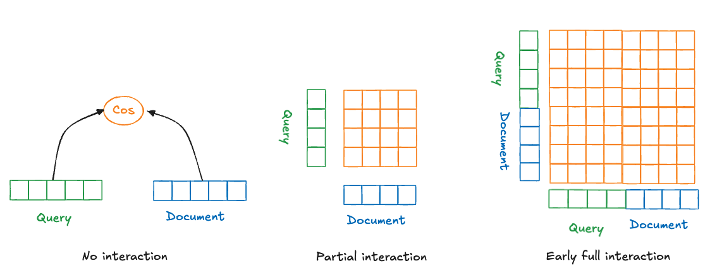
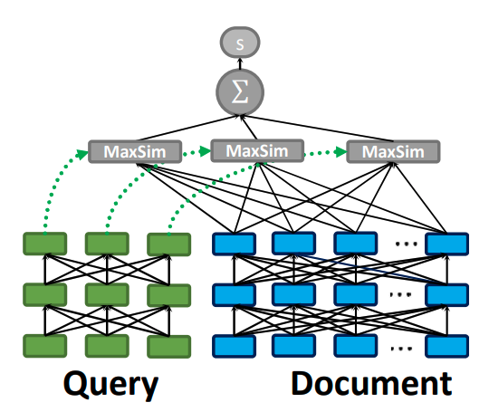
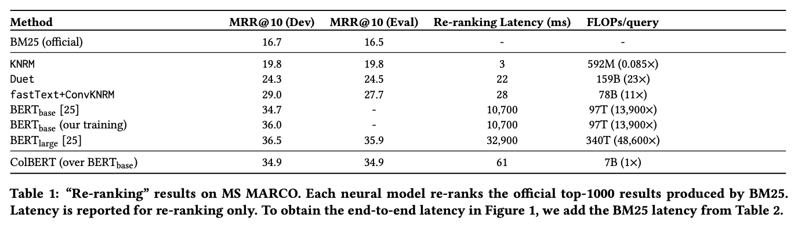
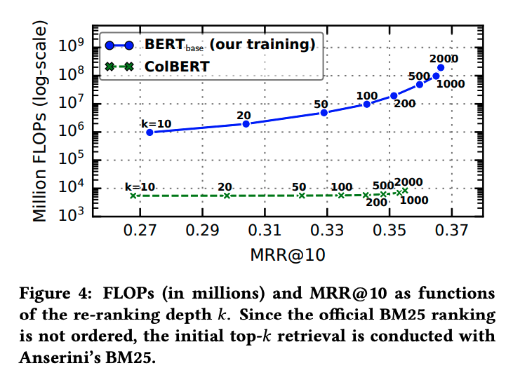



**TL;DR:** ColBERT combines the efficiency of a Bi-encoder, allowing fast embedding and precomputing, with a late interaction mechanism to learn cross-information between query and document. The result? Near-BERT performance at a fraction of BERT’s runtime!

> **Note:** This my personal learning note, so **some points may not be entirely accurate**. I strive to improve my understanding and will correct any errors I find. If you spot any inaccuracies, please feel free to share your insights to help enhance the content 😊. 

## Summary

**ColBERT** leverages independent encodings for queries and documents to generate fine-grained embeddings. It then applies a lightweight interaction mechanism to compute relevance scores. This innovative approach retains the expressiveness of BERT while significantly accelerating query processing. ColBERT, therefore, achieves comparable results to BERT-based models while drastically reducing computational overhead.

## Before ColBERT

Prior to ColBERT, ranking models could be grouped into three main paradigms:
1. **No Interaction**: Queries and documents have separate, independent encoders that capture the meaning of their respective inputs. However, embedding each query and document independently results in isolated representations, with no cross-information to link the two. This is known as the **bi-encoder** or **two-tower** paradigm. 
2. **Partial Interaction**: This approach attempts to capture relationships between the query and document but lacks the internal self-information of each input, effectively acting as an "inverted" version of the no-interaction paradigm. 
3. **Full Interaction**: Transformer-based models like BERT capture both self and cross information between the query and document. Although BERT-based models offer strong performance, their **high computational costs** pose challenges, especially in latency-sensitive applications.

## ColBERT’s Novel Approach

ColBERT bridges the gap between effectiveness and efficiency in models that leverage deep language models like BERT.

ColBERT introduces a **"late interaction" paradigm**, where queries and documents are independently encoded into sets of contextualized embeddings using BERT. A lightweight interaction mechanism, the **MaxSim** operation, then models fine-grained similarity between the query and document representations.

### Understanding MaxSim operation

For each word vector embedding in the query **bag embeddings** \\(E_q\\), **ColBERT** finds the **maximum word similarity score** with the word embeddings in the document \\(E_d\\). This is done through the **MaxSim** operator.

- The **MaxSim** operator calculates the **cosine similarity** between a single query embedding and all embeddings in document's bag embedding.
- The **highest similarity score** is then selected as the "match" for that specific query term.

This process is repeated for all embeddings in \\(E_q\\). The individual term scores are then summed to estimate the overall relevance of the document to the query.

### Why ColBERT stands out?

ColBERT's late interaction architecture for ranking documents in response to search queries relies on the MaxSim operator, which finds the highest cosine similarity score between each query term embedding and all document embeddings. Here’s why ColBERT is both effective and efficient: 
- **Computational Efficiency**: MaxSim avoids the heavy computational requirements of attention mechanisms: 
    - **MaxSim** involves calculating cosine similarity between query and document embeddings and then selecting the highest score per query term. 
    - In contrast, **Attention mechanisms** require multiple matrix multiplications and normalization steps, which are computationally expensive. 
    - **Pre-computing document embeddings** further accelerates ColBERT, as seen in no-interaction paradigms. 
- **Pruning Capability**: MaxSim allows vector-similarity search indexes to efficiently identify documents with terms highly similar (top-k) to the query, **without scoring every document** in the collection. Attention mechanisms, on the other hand, don’t lend themselves to such pruning. Although simple, MaxSim achieves state-of-the-art results when paired with BERT’s contextualized embeddings.

### ColBERT performance

In `Table 1` of the referenced article, ColBERT demonstrates competitive performance on ranking tasks compared to BERT, but with a significant reduction in runtime.

The `Figure 4` highlights ColBERT’s runtime efficiency: as the number of candidate documents (k) increases, ColBERT’s runtime remains relatively stable, underscoring its scalability and speed advantage over BERT.

## Short-Answer Quiz

**Questions**

1.  What is the main challenge that ColBERT addresses in the context of neural ranking models?
2.  Describe the "late interaction" paradigm introduced by ColBERT.
3.  How does ColBERT's architecture differ from traditional interaction-focused rankers (e.g., DRMM, KNRM)?
4.  Explain the role of query augmentation in ColBERT's query encoder.
5.  How does ColBERT's document encoder process document text and generate embeddings?
6.  Describe the late interaction mechanism in ColBERT and how it calculates the relevance score.
7.  What are the benefits of using a MaxSim-based interaction mechanism in ColBERT?
8.  How does ColBERT achieve efficiency in terms of offline indexing and query processing?
9.  Explain how ColBERT supports end-to-end retrieval from a large document collection.
10.  What are the key findings from the experimental evaluation of ColBERT on MS MARCO and TREC CAR datasets?

**Answer Key**

1.  ColBERT addresses the challenge of high computational cost associated with BERT-based ranking models, aiming to improve their efficiency without sacrificing effectiveness.
2.  Late interaction refers to the independent encoding of queries and documents into sets of contextualized embeddings followed by a lightweight interaction step to compute the relevance score. This allows for efficient pre-computation of document representations offline, reducing the online computational burden.
3.  Unlike traditional interaction-focused rankers that compute a single relevance score based on pairwise interactions between all query and document terms, ColBERT separates query and document encoding and relies on MaxSim to identify the most relevant document terms for each query term and aggregates these matches.
4.  Query augmentation involves padding the query with masked tokens, allowing BERT to generate query-based embeddings at these positions. This mechanism serves as a differentiable way to expand queries with new terms or re-weight existing terms based on their importance for matching.
5.  The document encoder segments the document into tokens, prepends special tokens, and passes the sequence through BERT. After applying a linear layer, it filters out embeddings corresponding to punctuation symbols to reduce the number of embeddings per document.
6.  ColBERT's late interaction mechanism computes the maximum similarity (cosine or L2 distance) between each query embedding and all document embeddings. The resulting maximum similarity scores are summed across all query terms to obtain the overall relevance score for the document.
7.  The MaxSim operation offers efficiency by enabling pruning for top-k retrieval. It allows using vector-similarity search indexes to efficiently retrieve the most promising document candidates without exhaustively scoring all documents.
8.  ColBERT pre-computes document representations offline, reducing the online computational load. During query processing, it encodes the query only once and interacts with the pre-computed document representations, further minimizing the cost.
9.  ColBERT leverages its pruning-friendly MaxSim operation to support end-to-end retrieval. It employs a vector-similarity search index (e.g., Faiss) to retrieve a subset of candidate documents based on the similarity of individual query embeddings to all document embeddings. This candidate set is then re-ranked using ColBERT's full scoring mechanism.
10.  Experimental results on MS MARCO and TREC CAR show that ColBERT achieves competitive effectiveness compared to state-of-the-art BERT-based models while being significantly more efficient. It outperforms other non-BERT baselines and demonstrates a considerable speedup and reduction in FLOPs compared to BERT.

## Conclusion

**ColBERT** offers a powerful ==balance between speed and accuracy== in information retrieval by combining the efficiency of a Bi-encoder with a novel late interaction mechanism. 
Its **MaxSim operator** allows for fine-grained similarity matching without the high computational costs of full attention, making it ideal for latency-sensitive applications. ColBERT’s performance, ==close to BERT but at a fraction of the runtime==, demonstrates the potential of innovative interaction mechanisms in neural IR. 

## References
- https://arxiv.org/pdf/2004.12832
- https://jina.ai/news/what-is-colbert-and-late-interaction-and-why-they-matter-in-search/