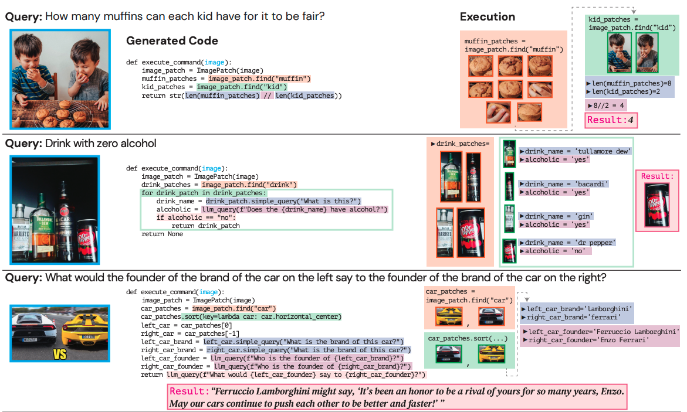
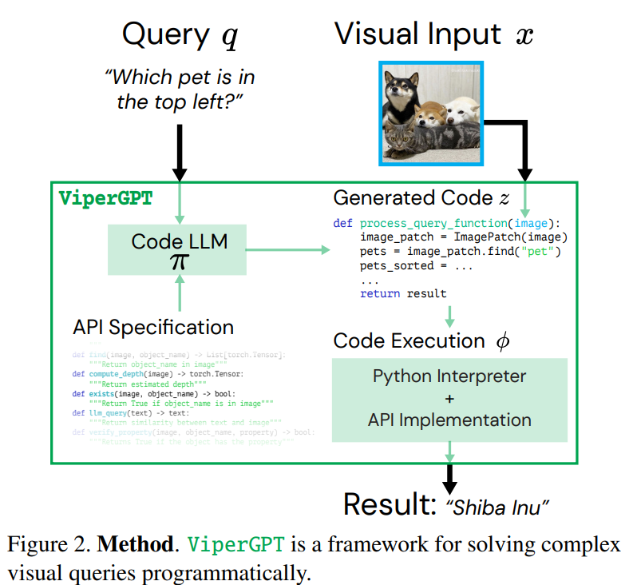



**TL;DR:** ViperGPT proposes a simple framework for solving complex visual queries by integrating code-generation models into vision with an API and the Python interpreter.

> **Note:** This my personal learning note, so **some points may not be entirely accurate**. I strive to improve my understanding and will correct any errors I find. If you spot any inaccuracies, please feel free to share your insights to help enhance the content 😊. 

## Summary
The framework's ability to generate and execute Python code, coupled with its access to a diverse set of pre-trained vision and language models through a well-defined API, enables ViperGPT to achieve impressive zero-shot performance on a wide range of visual reasoning tasks.

## Motivation

**ViperGPT** is motivated by the limitations of **end-to-end models**, which are the dominant approach for **answering visual queries**. While end-to-end models have made significant progress in individual tasks such as object recognition and depth estimation, they struggle with more **complex tasks that require both visual processing and reasoning**. ViperGPT seeks to overcome these limitations by introducing a **modular and interpretable approach** to visual reasoning.

## Before ViperGPT
- **Lack of Compositional Reasoning**: End-to-end models do not explicitly **differentiate between visual processing and reasoning**, making it difficult for them to handle complex, multi-step tasks. People naturally **decompose visual tasks into smaller steps**, but end-to-end models lack this inherent compositional reasoning ability. 
- **Limited Interpretability**: End-to-end models offer little insight into their decision-making process, making it **difficult to understand why they succeed or fail**. This lack of interpretability, described as having no way to audit the result of each step to diagnose failure, becomes increasingly problematic as models become more complex and data-hungry.
- **Inability to Leverage Existing Models and Tools**: End-to-end models necessitate **training a new model for every new task**, failing to capitalize on the advancements in fundamental vision tasks and readily available tools like mathematical operations. Ideally, new tasks should be tackled by recombining existing models and tools in innovative ways without requiring additional training3.

## ViperGPT

### Problem formulation
Given a visual input `x` and a textual query `q` about its contents, it first synthesizes a program `z = π(q)` with a program generator `π` given the query. It then applies the execution engine` r = ϕ(x, z)` to execute the program `z` on the input `x` and produce a result `r`. This framework is flexible, supporting image or videos as inputs `x`, questions or descriptions as queries `q`, and any type (e.g., text or image crops) as outputs `r`.

### Program generator
This process uses a **large language model (LLM)** called **Codex** to create Python programs that can answer a given query using various vision and language modules. The LLM is provided with an API specifying the available modules and their functionalities1. This process requires no training for specific tasks

### API Specification
The API specification plays a crucial role in ViperGPT by serving as a bridge between the code-generating LLM (Codex) and the various vision and language modules that it uses to answer visual queries. Instead of directly implementing the API, the authors of ViperGPT made the design decision to provide Codex with a specification of the API, including **function signatures, docstrings, and examples**.

### Program Executor

The generated Python programs are then executed by the Python interpreter, which utilizes pre-trained models to carry out the instructions within the program. This execution engine allows the model to perform **logical operations** through **Python** and **perceptual tasks** through **pre-trained models**. This process ensures the program's interpretability as each step is explicitly outlined with code function calls and intermediate values that can be examined.

## Why ViperGPT stands out?

-   **Interpretability**: Every step of the reasoning process is explicit and can be inspected, as it is represented in the form of code.
-   **Compositionality**: Tasks are decomposed into smaller sub-tasks, promoting a more human-like approach to visual reasoning.
-   **Logical Reasoning**: ViperGPT leverages built-in Python logical and mathematical operators, enabling clear and explicit logical reasoning.
-   **Flexibility**: ViperGPT seamlessly incorporates any vision or language module by simply adding its specification to the API.
-   **Adaptability**: Improvements in individual modules directly enhance ViperGPT's performance.
-   **Training-free**: ViperGPT eliminates the need for retraining or fine-tuning for every new task.
-   **Generality**: A single system unifies various visual tasks.

## Weaknesses
There are several weaknesses that could be addressed to strengthen the work:
-   **Limited Evaluation** on Real-World Tasks: further evaluation on more diverse and realistic datasets would strengthen the paper's claims of generalizability and practical applicability.
-   Dependence on **Manually Crafted Prompts/Instruction**: Developing methods for automatically generating or learning effective prompts would enhance the system's autonomy and practicality
-   **No Feedback/Verification Pipeline**: Although visual rationales are used for error analysis, there is currently no automated pipeline for improving instructions based on correct or incorrect cases.

## Conclusion
ViperGPT presents a compelling alternative to end-to-end models for complex visual tasks. By leveraging the power of programmatic composition and pre-trained modules, it achieves strong zero-shot performance while maintaining interpretability and flexibility. As the field of vision and language models continues to advance, ViperGPT's ability to readily incorporate these advancements makes it a promising direction for future research.

## Reference
- https://viper.cs.columbia.edu/