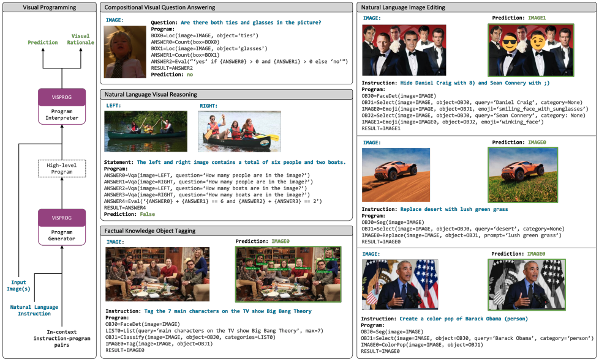
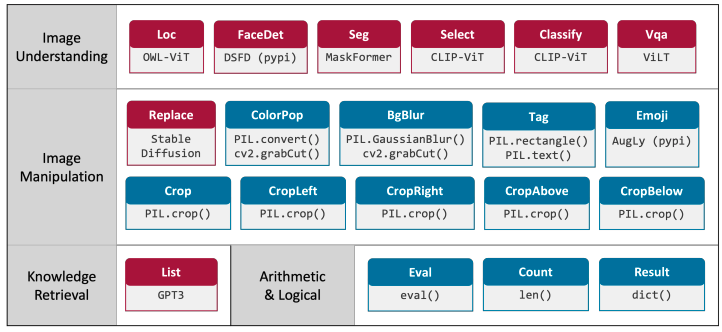



# VISPROG: A Neuro-Symbolic Approach to Visual Reasoning
- Project page: https://prior.allenai.org/projects/visprog
- ArXiv: https://arxiv.org/abs/2211.11559
- GitHub: https://github.com/allenai/visprog

**TL;DR**: Concurrent work with [ViperGPT](https://itskoi.github.io/posts/reading-papers-vipergpt/). Similar to ViperGPT but generates pseudo code rather than Python code.

## Summary

The paper introduces VISPROG, a neuro-symbolic system that tackles complex visual tasks by leveraging large language models (LLMs) to generate executable Python-like programs. These programs compose various off-the-shelf computer vision models, image processing routines, and logical operators to solve diverse visual tasks described in natural language.

## Motivation

Traditional end-to-end trained vision and language models struggle to address the vast range of complex tasks users desire, as training such models requires extensive, curated datasets for each specific task. The authors propose VISPROG as an alternative approach to handle the "long tail" of complex tasks by decomposing them into simpler steps manageable by existing specialized modules.

## Methodology

- **Program Generation via In-Context Learning:** VISPROG utilizes the in-context learning capabilities of LLMs (specifically GPT-3) to generate programs. It prompts the LLM with a natural language instruction and a few examples of similar instructions paired with their corresponding programs. The LLM then generates a program for the new instruction.
- **Modular Structure:** VISPROG relies on a diverse set of modules (currently 20) that encompass:

  - Computer vision models (e.g., object detectors, image classifiers, image generators)
  - Image processing subroutines (e.g., cropping, resizing, filtering)
  - Python functions for arithmetic and logical operations.
- **Program Execution and State Management:** An interpreter executes the generated program line by line, invoking the appropriate modules with the specified inputs. The interpreter maintains a program state (a dictionary) to track variable names and their values, ensuring the flow of information between program steps.
- **Visual Rationale Generation:** Each module provides an HTML snippet summarizing its inputs and outputs, which the interpreter assembles into a comprehensive visual rationale. This rationale offers insights into the program's execution and facilitates error analysis and user intervention.

## Benchmarks

- **GQA:** VISPROG demonstrates improved accuracy over a baseline VQA model on a subset of the GQA dataset for compositional visual question answering.
- **NLVRV2:** VISPROG achieves strong zero-shot performance on the NLVRV2 benchmark for visual reasoning on image pairs, even without training on image pairs.
- **Factual Knowledge Object Tagging:** The authors create a dataset for knowledge tagging and show promising results, highlighting VISPROG's ability to combine object detection with knowledge retrieval.
- **Language-Guided Image Editing:** VISPROG effectively handles a variety of image editing instructions, including object manipulation, style transfer, and context replacement.

## Strengths

- **Training-Free Adaptability:** VISPROG does not require training any of its components for new tasks. Adapting to a new task merely involves providing a few in-context examples of instructions and corresponding programs.
- **Modular and Interpretable:** The use of explicit programs and visual rationales enhances transparency and understandability. Users can inspect individual program steps and their outcomes, making the reasoning process clear and auditable.
- **Compositional Power:** VISPROG's modular design allows for flexible composition of diverse capabilities. The ability to combine various modules in a programmatic manner enables VISPROG to address complex tasks that would be challenging for single end-to-end trained models.
- **Handles Diverse Tasks:** The authors demonstrate VISPROG's versatility on four distinct tasks: compositional visual question answering, zero-shot reasoning on image pairs, factual knowledge object tagging, and language-guided image editing.

## Weaknesses

Several areas could be improved to strengthen the work:

- **Limited Evaluation on Real-World Tasks:** Further evaluation on more diverse and realistic datasets would strengthen the paper's claims of generalizability and practical applicability.
- **Dependence on Manually Crafted Instructions:** Developing methods for automatically generating or learning effective prompts would enhance the system's autonomy and practicality.
- **No Feedback/Verification Pipeline:** Although visual rationales are used for error analysis, there is currently no automated pipeline for improving instructions based on correct or incorrect cases.

## Future Work

The paper focuses on demonstrating the feasibility and flexibility of the VISPROG approach. Future work may explore:

- Optimizing prompt engineering for improved program generation.
- Incorporating user feedback to refine program generation and enhance system performance.
- Expanding the module library to broaden VISPROG's capabilities.

## Conclusion

VISPROG represents a promising neuro-symbolic approach to tackling complex visual reasoning tasks by combining LLM-driven program generation with modular execution of specialized vision and processing functions. Through its flexible and interpretable design, VISPROG shows the potential to handle a broad range of tasks without retraining. With further improvements in prompt engineering, feedback integration, and module expansion, VISPROG could offer a scalable, adaptable solution for many practical applications in visual reasoning.
