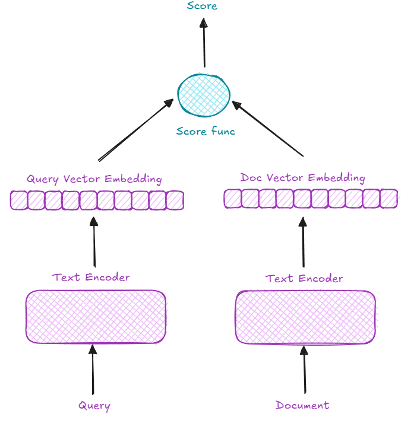
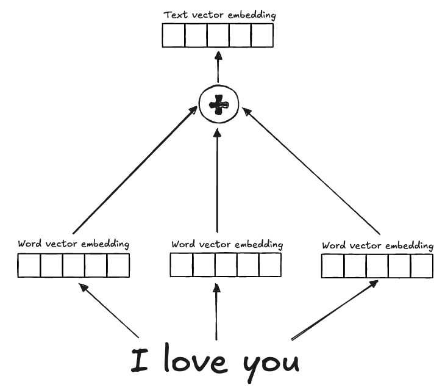
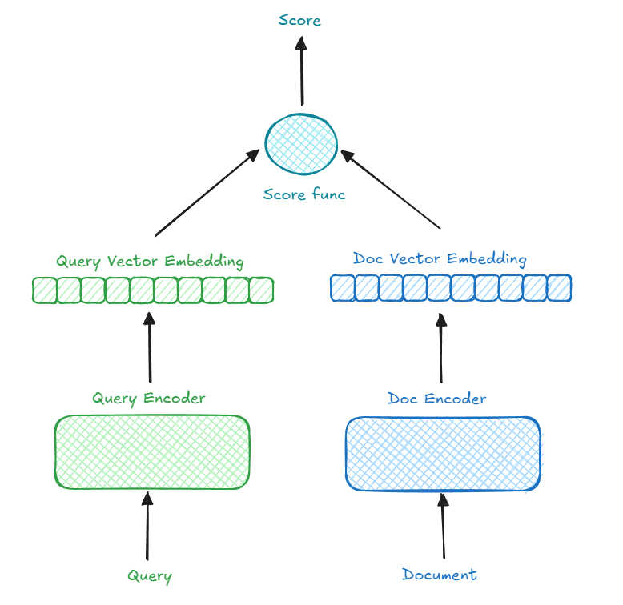
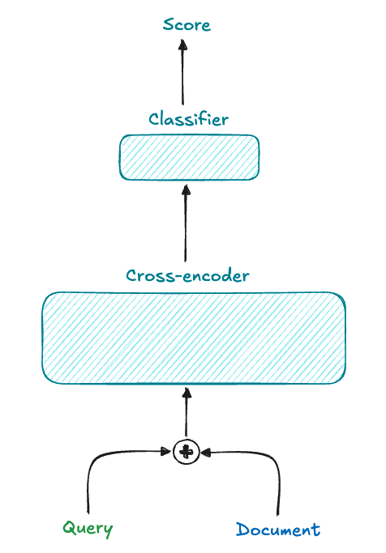



**Information Retrieval (IR)** is a well-established field, and text retrieval is one of its core tasks. With the growing applications of IR in the digital era, efficient **text retrieval** has become essential. The rise of Retrieval-Augmented Generation (RAG) has heightened the demand for fast, accurate retrievers.

In developing RAG systems, this series of posts serves as my notes and reflections on building effective system. Let's delve into **text retrieval**!

> **Note:** These are my personal learning notes, so **some points may not be entirely accurate**. I strive to improve my understanding and will correct any errors I find. If you spot any inaccuracies, please feel free to share your insights to help enhance the content 😊. 

## Objective

In this post, I’ll cover the fundamental terms and concepts you'll encounter in text retrieval, giving a big-picture overview rather than fine-grained details. This will help you understand the essential ideas and terminology needed to explore the field further.

## Formulate the problem

Given a set of queries `q` and documents `d`, the task is to identify the most relevant document for each query based on the "similarity score" between them.

To tackle this, we need to address two key questions:

-   How should we represent the text?
-   Based on these representations, how can we calculate a meaningful similarity score between queries and documents?

A basic approach to text retrieval is **word matching** or term matching. Initially, we can represent text using a **Bag-of-Words (BoW)** model, where each word occupies a dimension in a sparse, high-dimensional vector space. However, this high-dimensional approach can be **computationally intensive**. To make retrieval more efficient, we can transform the text into **lower-dimensional dense embeddings**—compact representations that retain semantic meaning.

Once we have these embeddings, our task is to calculate similarity scores between these vectors effectively.

Let’s explore each part in more detail.

## Text Representation
### Word matching
The naive approach is to match words between a query and a document. Using a basic algorithm, we start with a similarity score of zero and increase it each time a matching word is found between query and document.

This approach has a time complexity of \\(O(|q| * |d| * l_q * l_d)\\) on average, where |q| and |d| are the number of queries and documents, respectively, and \\(l_q\\), \\(l_d\\) are the average words in a query and document. By pre-processing documents into sets of words, we can reduce lookup operations to \\(O(1)\\) on average, decreasing time complexity to \\(O(|q| * |d| * l_q)\\). For long documents, this improvement significantly reduces runtime.

### Sparse Embeddings

Building on word matching, we can create **one-hot vector embeddings** for each document with dimensions equal to the vocabulary size, \\(|v|\\). This **Bag-of-Words** representation, or sparse embedding, contains mostly zeros since only a small fraction of the vocabulary appears in any single text.

For each query, we create a one-hot vector and compute similarity scores across documents. Although this method has similar time complexity to word matching, it allows for **parallel computing techniques like matrix multiplication** on GPU/TPU, often used in machine learning to improve efficiency.

>  **:bulb:Key insight:** Embedding text information into vectors enables efficient computation of similarity scores.

By introducing weighting (e.g., using TF-IDF or BM25), we assign greater significance to key terms, enhancing retrieval quality while retaining simplicity.

Sparse embeddings, however, have limitations, especially in distinguishing synonyms, handling ambiguous terms, and still lack semantic awareness, pushing us toward **dense embeddings**.

### Dense Embeddings

Dense embeddings focus on capturing semantic meaning by encoding text into low-dimensional vectors. Two common approaches are:

-   **Word embeddings**: Combine embeddings for each word in the text (e.g., Word2Vec, GloVe, etc).
-   **Sentence embeddings**: Represent entire text passages, capturing not only word meanings but also relationships between them, typically using transformer-based models.

Using dense embeddings also addresses the problem of high-dimensional, sparse vectors in Bag-of-Words, reducing the vector space while retaining richer semantic context.

**Word embedding**
Common approaches for word embedding include Word2Vec, GloVe,etc. In these methods, embeddings are generated for **individual words** and then **combined** using **linear projections** or similar techniques. However, because information is extracted independently from each word and then fused with a general merging approach, the final text embedding often **lacks a coherent relationship** between words, resulting in suboptimal representations.

**Sentence embedding**
Unlike word embeddings, sentence embeddings capture not only the meaning of individual words but also the relationships between them within a sentence. This holistic approach provides better performance compared to combining individual word embeddings. Transformer-based models are currently the most popular choice for generating these embeddings, as they excel at capturing semantic and syntactic relationships within the text.

Initially, a single encoder might be used to embed both queries and documents without distinction. However, this poses two main issues:

1.  **Structural Mismatch**: Queries and documents often differ in structure, with queries, for example, frequently being Wh-questions.
2.  **Lack of Relevance Modeling**: When each document and query is embedded independently, the context and meaning are isolated, lacking a shared relevance between them.

Let’s explore how to address these issues.

### Bi-encoder or Two-tower
To better **capture structural differences** between queries and documents, we can use a **bi-encoder** or **dual-encoder** or **two-tower** approach, where two independent encoders process queries and documents. For instance, BERT can serve as the backbone for both encoders, fine-tuned using contrastive learning. This setup significantly improves retrieval performance compared to using a single encoder for all input.

After having embeddings for both query and document, we need to compute the similarity between them. In common, we have 3 methods: 
- **L2 Distance (Euclidean Distance)**: measures the **straight-line distance** between two vectors in a multidimensional space.
- **Cosine Similarity**: measures the cosine of the **angle between two vectors**, which reflects their orientation rather than their magnitude.
- **Dot Product**: represents the _magnitude of alignment_ between two vectors in terms of both their **magnitudes** and the **cosine of the angle between them**.

Use whatever you like if it differentiate if the 2 vectors is not similar and emphasize if 2 vector

### Cross-encoder
To address the **lack of semantic interaction** in bi-encoders, **cross-encoders** combine both the query and document into a **single input** separated by a special token (e.g., `query<sep>document`). 

This setup allows the model to learn complex relationships between queries and documents, often leading to more accurate retrieval. However, the **trade-off is speed**, making cross-encoders less practical for large document collections. 

As a result, **cross-encoders** are often used as **rerankers** in two-stage retrieval systems, with **bi-encoders** serving as the **initial retrievers**.

## Conclusion

In this post, we introduced the text retrieval problem and covered techniques ranging from simple text matching to sophisticated cross-encoder models for capturing query-document relationships. 

In future posts, we’ll dive into the bi-encoder, cross-encoder, two-stage retrieval paradigm, examining the components, challenges, and optimizations in detail. Stay tuned! 😊

